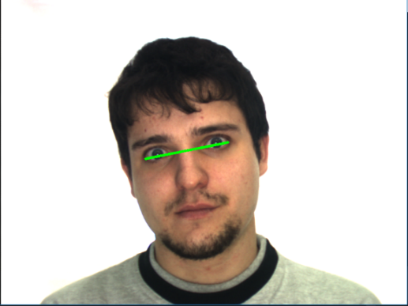
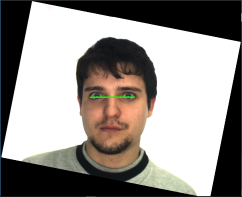

# FACE ROTATION AND REDRESS 
--- 
One of the first steps in any pipeline project of machine learning/data science is cleaning data, cleaning data can be applied with different techniques, it depends on the type of data ...

In my internship, the goal was to implement several scientific papers on face recognition. in our case, one of the problems is when we have a rotated face in our images ( training and testing ), for that we develop this script which can redress any face on an image.

algorithm :

1. Detect the face on image.
2. Detect the position of eyes with a landmark point.
3. Calculate the angle between a line that passes through the centers of two eyes and the line that is horizontal with respect to the image.
4. Finally, we rotate the image with the angle.

